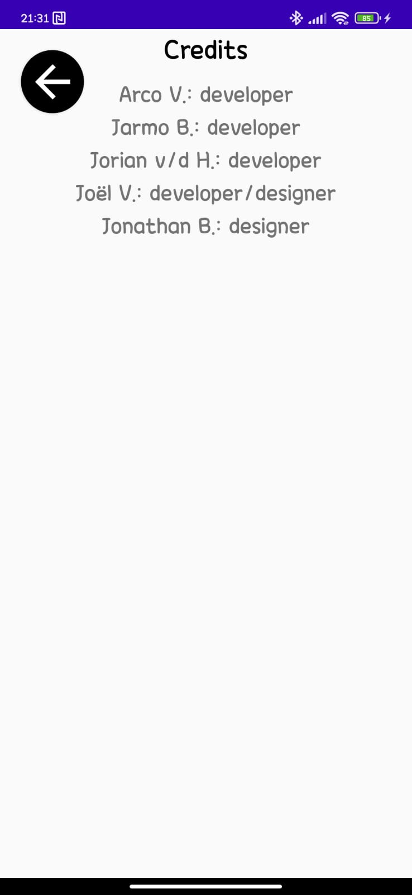
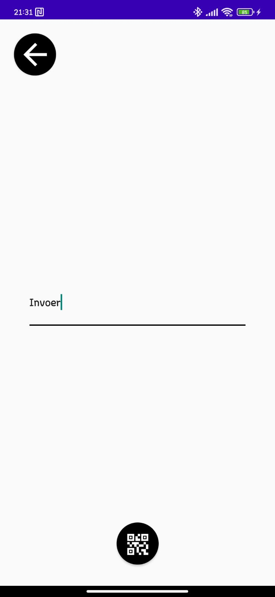
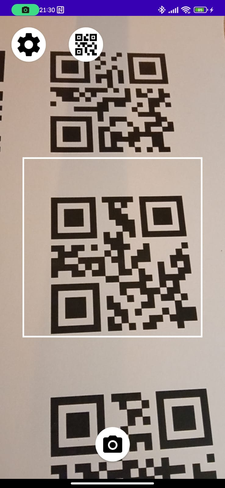
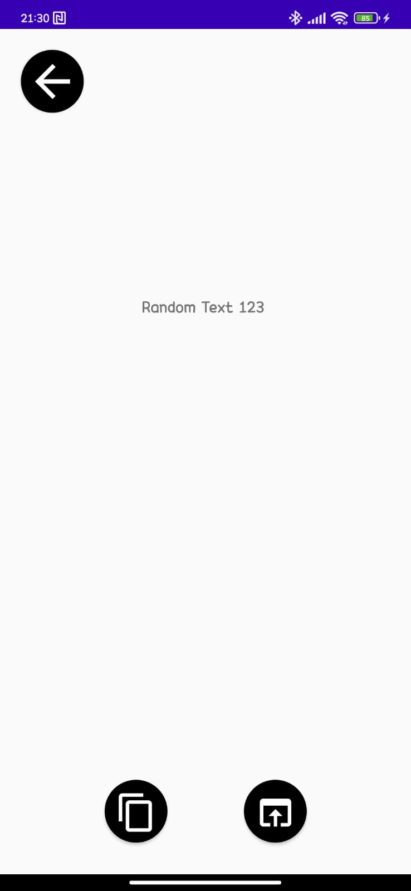

# General description
For our computer science project, we have chosen to create an app that reads and generates QR codes. We developed the app using the Android Studio program in the Kotlin language. To better illustrate what it looks like, below are all the screens with a brief description of each.

# Credits
On this screen you can find the names of the developers/designers of the app.

# QR-code generator input
On this screen, you can find a text box that allows you to convert text into a QR code.

# QR-code reader input
On this screen you can scan a QR-code with the camera of your mobile phone to convert it into text.

# QR-code reader output
On this screen you can find the text that has been converted from a QR-code.

